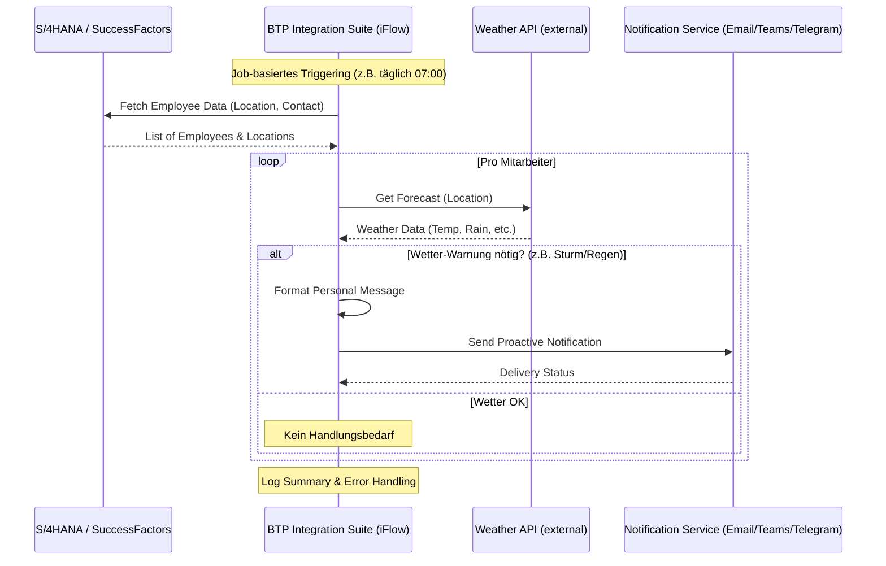

# System Design: Proaktive Wetter-Benachrichtigung für Mitarbeiter

## Übersicht
Dieses System extrahiert Mitarbeiter-Standorte aus SAP-Systemen (S/4HANA oder SuccessFactors) und sendet proaktive Wetterwarnungen.

## Architektur (Mermaid)

## Best Practices & Ausnahmen
### Best Practices
- **Batch Processing:** Abruf der Mitarbeiterdaten gesammelt, um API-Calls zu minimieren.
- **Payload-Filterung:** Nur notwendige Felder (Email, City) von SAP abfragen.
- **Asynchrone Benachrichtigung:** Die Integration Suite wartet nicht auf die Zustellung der Nachricht, um den Prozess nicht zu blockieren.

### Ausnahmen (Error Handling)
- **API Timeout:** Implementierung eines Exponential Backoff bei der Wetter-API.
- **Fehlende Standortdaten:** Mitarbeiter ohne validen Standort werden geloggt, aber der Prozess läuft für andere weiter.
- **Rate Limiting:** Einhaltung der Quotas der externen Wetter-API.
